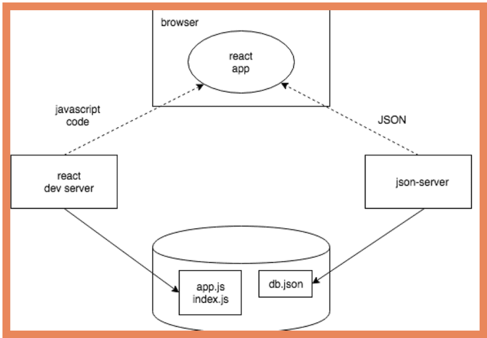

# Overview
Part 2 of the course will introduce how JavaScript in the browser can fetch and handle data stored in a remote backend server, utilizng concepts such as: **Effect-hooks**, **Axios and promises**, and **REST APIs**. 

## Coursework App Projects 

* part2-notes (Notes)
* Countries
* Phonebook

